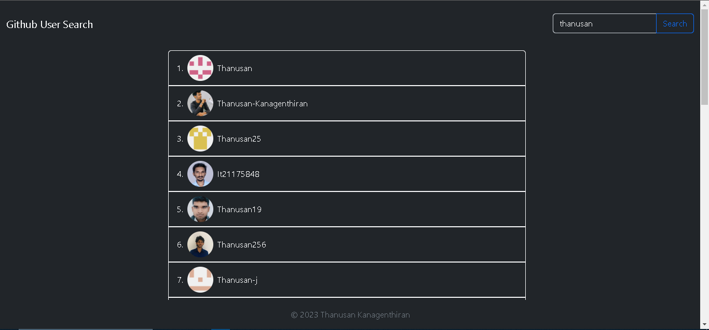

# GitHub User Search

This is a simple project that allows you to search for GitHub users and display the details of a particular user.

## How to Use

1. Clone the repository to your local machine.
2. Open the index.html file in your browser.

## Live Demo

You can try the live demo [here](https://thanusan.tech/github-users-search/).

## Technologies Used

- HTML
- CSS
- JavaScript
- Bootstrap

## API Used

The project uses the GitHub REST API to search for users and retrieve user details. Specifically, the following endpoints are used:

- `/search/users?q={query}` to search for users.
- `/users/{username}` to retrieve the details of a particular user.

You can find more information about the GitHub REST API v3 in the official documentation [here](https://docs.github.com/en/rest?apiVersion=2022-11-28)

## Notes

- The project uses async/await to make asynchronous requests to the API.
- If no users are found when searching, an error message will be displayed.
- If there is an error while making a request to the API, an error message will be displayed.
- UI has been developed responsive

## Sample Images

